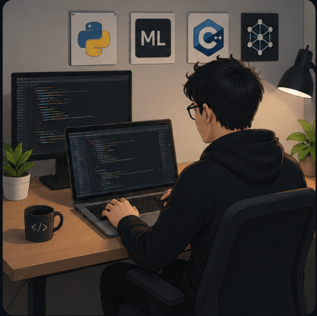
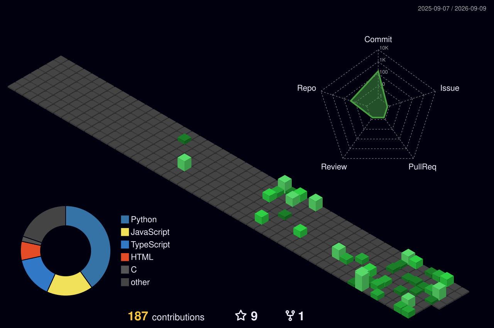

<div align="center">

<!-- 3D ANIMATED HEADER -->


<!-- ANIMATED TYPING -->
<a href="https://github.com/GVethaNarayanan">
  
</a>

<!-- PROFILE BADGES -->
<p>
  <a href="https://www.linkedin.com/in/vetha-narayanan-782724309/"></a>&nbsp;
  <a href="mailto:vethanarayanang007@gmail.com"></a>&nbsp;
  <a href="https://www.instagram.com/_vetha_.07/"></a>&nbsp;
  <a href="https://github.com/GVethaNarayanan"></a>&nbsp;
  <a href="https://leetcode.com/u/VethaNarayananG/"></a>
</p>

<p>
  
  
  
</p>

</div>

<!-- ABOUT ME SECTION -->


## ⚡ Quick Overview

```yaml
name: Vetha Narayanan G
location: Chennai, India 🇮🇳
education: B.Tech IT @ CIT (2024-2028)
cgpa: 7.96
role: Software Engineer | AI/ML Developer

currently_building:
  - SepsiSense AI (Sepsis Prediction)
  - Personal Blog & Portfolio

experience:
  - AI Intern @ LGTG Solutions (2026)
  - Web Dev Intern @ Zizzle Technologies (2025)

achievements:
  leetcode: 500+ problems solved
  skillrack: 160+ problems solved
  ai_projects: 5+ deployed
  
open_to: Internships | AI Research | Collaborations
```

<br clear="both"/>

---

<!-- 3D TECH STACK ICONS -->
## 🧊 Tech Universe

<div align="center">

<table>
<tr>
<td align="center" width="100">
  
  <br><sub><b>Python</b></sub>
</td>
<td align="center" width="100">
  
  <br><sub><b>Java</b></sub>
</td>
<td align="center" width="100">
  
  <br><sub><b>JavaScript</b></sub>
</td>
<td align="center" width="100">
  
  <br><sub><b>C</b></sub>
</td>
<td align="center" width="100">
  
  <br><sub><b>HTML5</b></sub>
</td>
<td align="center" width="100">
  
  <br><sub><b>CSS3</b></sub>
</td>
<td align="center" width="100">
  
  <br><sub><b>React</b></sub>
</td>
</tr>
<tr>
<td align="center" width="100">
  
  <br><sub><b>Node.js</b></sub>
</td>
<td align="center" width="100">
  
  <br><sub><b>Express</b></sub>
</td>
<td align="center" width="100">
  
  <br><sub><b>Flask</b></sub>
</td>
<td align="center" width="100">
  
  <br><sub><b>Tailwind</b></sub>
</td>
<td align="center" width="100">
  
  <br><sub><b>MongoDB</b></sub>
</td>
<td align="center" width="100">
  
  <br><sub><b>MySQL</b></sub>
</td>
<td align="center" width="100">
  
  <br><sub><b>TensorFlow</b></sub>
</td>
</tr>
<tr>
<td align="center" width="100">
  
  <br><sub><b>AWS</b></sub>
</td>
<td align="center" width="100">
  
  <br><sub><b>Docker</b></sub>
</td>
<td align="center" width="100">
  
  <br><sub><b>Git</b></sub>
</td>
<td align="center" width="100">
  
  <br><sub><b>GitHub</b></sub>
</td>
<td align="center" width="100">
  
  <br><sub><b>VS Code</b></sub>
</td>
<td align="center" width="100">
  
  <br><sub><b>Linux</b></sub>
</td>
<td align="center" width="100">
  
  <br><sub><b>Postman</b></sub>
</td>
</tr>
</table>

**AI / ML Stack**


</div>

---

<!-- 3D GITHUB STATS -->
## 📊 GitHub Analytics

<div align="center">
  
  
</div>

<div align="center">
  
</div>

<br/>

<div align="center">
  
</div>

---


<!-- 3D CONTRIBUTION CALENDAR -->
## 🌌 3D Contribution Map

<div align="center">
  <picture>
    <source media="(prefers-color-scheme: dark)" srcset="./profile-3d-contrib/profile-night-green.svg"/>
    <source media="(prefers-color-scheme: light)" srcset="./profile-3d-contrib/profile-green-animate.svg"/>
    
  </picture>
</div>

---

<!-- TROPHIES -->
## 🏆 GitHub Trophies

<div align="center">
  
</div>

---

<!-- SNAKE ANIMATION -->
## 🐍 Contribution Snake

<div align="center">
  <picture>
    <source media="(prefers-color-scheme: dark)" srcset="https://raw.githubusercontent.com/GVethaNarayanan/GVethaNarayanan/output/github-snake-dark.svg"/>
    <source media="(prefers-color-scheme: light)" srcset="https://raw.githubusercontent.com/GVethaNarayanan/GVethaNarayanan/output/github-snake.svg"/>
    
  </picture>
</div>

---

<!-- FEATURED PROJECTS -->
## 🚀 Featured Projects

<div align="center">

<a href="https://github.com/GVethaNarayanan/Personal-Blog">
  
</a>
<a href="https://github.com/GVethaNarayanan/Resume-Analyzer">
  
</a>
<a href="https://github.com/GVethaNarayanan/Phishing-Detection-Sys">
  
</a>
<a href="https://github.com/GVethaNarayanan/opportunity-radar-final">
  
</a>

</div>

---

<!-- DEV QUOTE -->
## 💭 Dev Philosophy

<div align="center">
  
</div>

---

<!-- FOOTER -->
<div align="center">

### 🤝 Let's Build Something Amazing Together

<a href="https://www.linkedin.com/in/vetha-narayanan-782724309/"></a>&nbsp;
<a href="mailto:vethanarayanang007@gmail.com"></a>&nbsp;
<a href="https://github.com/GVethaNarayanan"></a>

<br/><br/>


</div>
